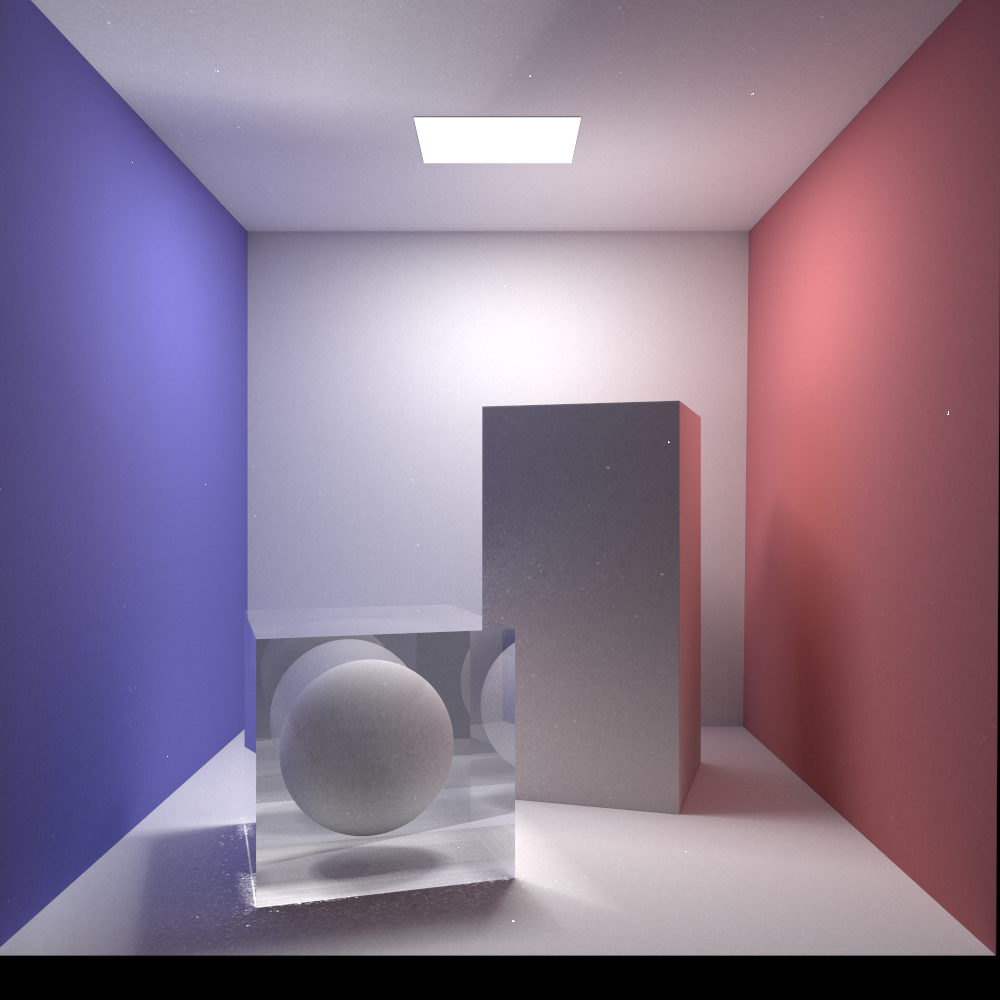

Miyuki Renderer

This is a hobby project as I learn pbrt. (see http://pbrt.org)

Inspired by https://github.com/JamesGriffin/Path-Tracer, 	https://github.com/fogleman/pt

It's so difficult to implements those algorithms, especially for one not good at statistics. Maybe I'll just stick with path tracing and sppm. They are the most simple and robust algorithms.

##  Features:

It is currently using path tracing, bidirectional path tracing, photon mapping (https://graphics.stanford.edu/courses/cs348b-00/course8.pdf)., and sppm. I chose BVH as acceleration structure, with naive split strategy.

It loads .obj files using tiny_obj_loader (the same as my previous projects).

It uses SIMD instructions to intersect multiple triangles at once, resulting in roughly 30%-50% speed boost.

A non-local means filter is used as denoiser (using opencv)

## TODO List:
0. Rewrite a GPU version with path tracing and sppm only
1. ~~Path tracing with next event estimation~~
2. ~~Photon mapping~~
3. ~~sppm  (Stochastic Progressive Photon Mapping)~~ (see https://www.ci.i.u-tokyo.ac.jp/~hachisuka/ppm.pdf and https://www.ci.i.u-tokyo.ac.jp/~hachisuka/sppm.pdf)
4. ~~Bidirectional path tracing~~
5. ~~Multiple Importance Sampling (MIS)~~
6. Metropolis Light Transport (Possibly PSSMLT)
7. Vertex Connection and Merging (VCM)
8. Rasterizer (for fun)
9. Toon shading
10. Instant radiosity
11. Loading model files using GUI
12. Physically based reflection models
13. Grids
14. Surface heuristic
15. Better sampler
16. Texture
17. Volumetric
18. Participating media
19. Spectrum
20. Depth of field
21. Refactoring (the GUI module is rubbish)
22. Non-local means filter (I wrote one but it doesn't work)
23. Programmable shader (possibly a homemade JIT compiler)

## Gallery

Glossy surface rendered using MIS

From old CPU version:

