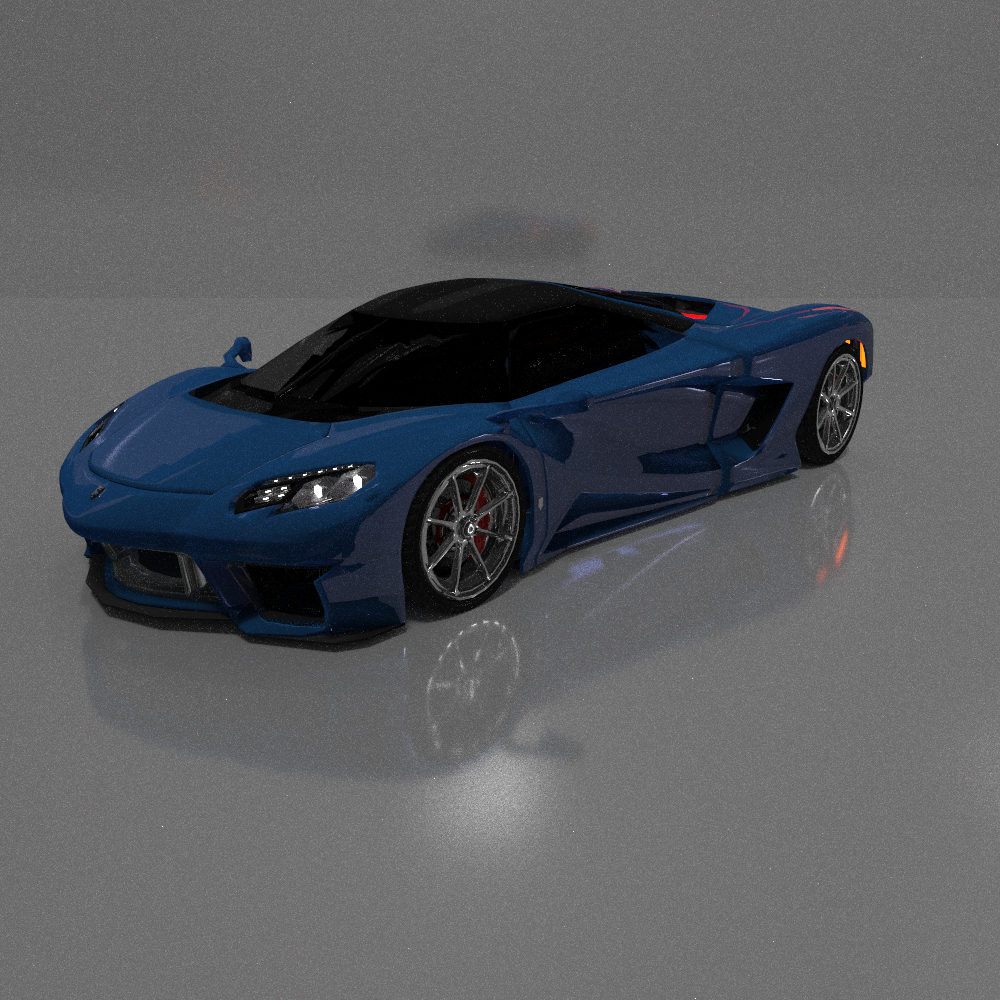
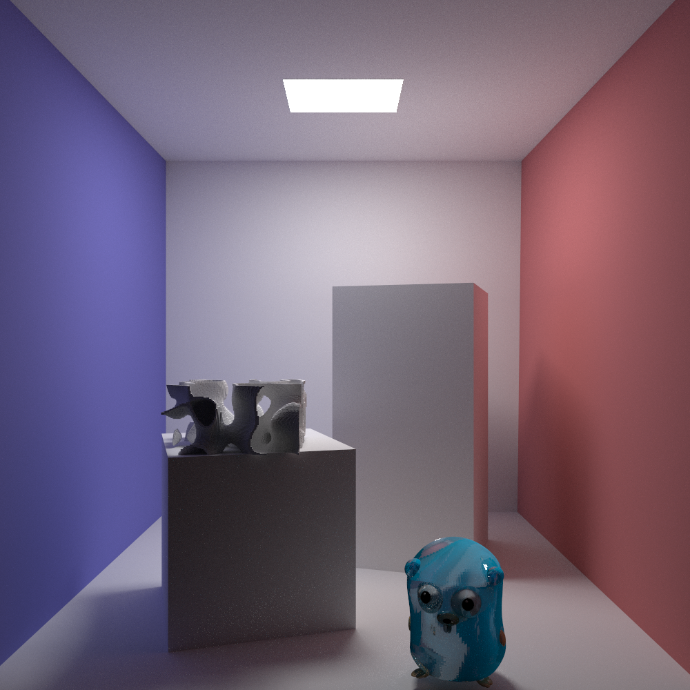
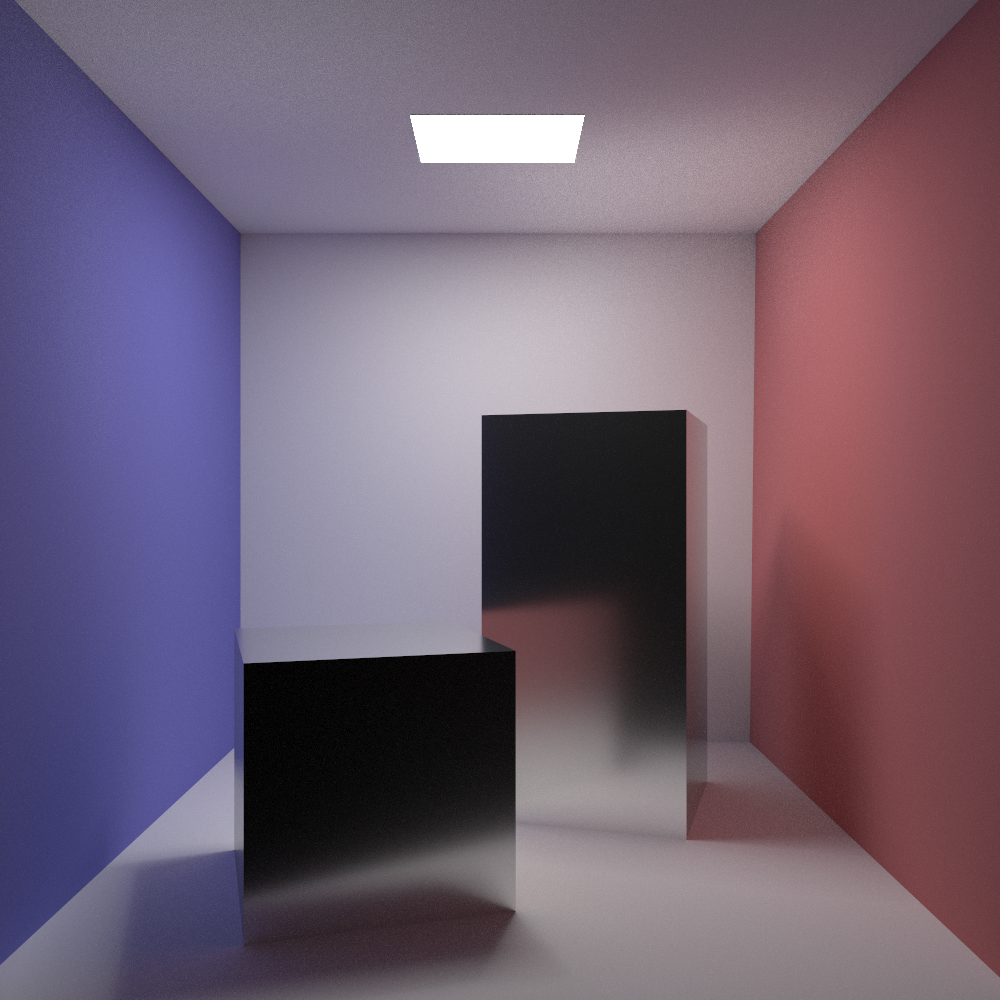

# Miyuki Renderer(WIP)

```
        _             _    _     __                _
  /\/\ (_)_   _ _   _| | _(_)   /__\ ___ _ __   __| | ___ _ __ ___ _ __
 /    \| | | | | | | | |/ / |  / \/// _ \ '_ \ / _` |/ _ \ '__/ _ \ '__|
/ /\/\ \ | |_| | |_| |   <| | / _  \  __/ | | | (_| |  __/ | |  __/ |
\/    \/_|\__, |\__,_|_|\_\_| \/ \_/\___|_| |_|\__,_|\___|_|  \___|_|
          |___/
```

Goal: a high performance pbrt-style renderer. Using Embree for accelerated ray-primitive intersection.

## Current Progress (In inverse chronolocial order)
Debugging BDPT is total nightmare.

Refactoring is done. Now we can handle `BSDF`s easier and faster.

I'm planning of another structual refactoring. I'm not quite satisfied with the way pbrt implements materials and bsdfs because I dislike dynamic memory allocation, even if the memory arena is super fast.

We are more and more pbrt-like! Added memory arena so that we can implement `Material` and `BSDF` as pbrt does.

We have ambient occlusion and path tracing with next event estimation and multiple importance sampling.

A PSSMLT running on path tracer is also implemented.

##  TODO List

1. Volumetric Path tracing with NEE
2. ~~Ambient Occlusion~~
3. Stochastic Progressive Photon Mapping
4. ~~Primary Sample Space Metropolis Light Transport (Unidirectional)~~
5. Primary Sample Space Metropolis Light Transport (Bidirectional)
6. Multiplex Metropolis Light Transport
7. Bidirectional Path Tracing with MIS
8. Multiple Importance Sampling
9. Vertex Connection and Merging
10. ~~Importance sampling for light source~~
11. Mixed BSDF (partially)
12. Material system
13. Fourier BSDF

# Gallery (Random test images)








# About the Miyuki_old

That's my another attempt in creating a physically based renderer. It has many algorithms implemented but it's not that efficient comparing to Embree and GPU based renderer, despite the fact that I have used SIMD intrinsic to speed up ray-primitive.

There are reasons why this new attempt is not GPU based. One of them is that writing OpenCL (my laptop doesn't have NV GPU) involves lots of nasty stuff and hard-to-debug code, not to mention the fact the some rendering algorithms requires tens to thousands of Ms of additional memory.<br/>
Edit: Tried to write OpenCL again, the compiler is giving me tons of segfault. Nevertheless, BVH+SAH on GPU is really fun.
