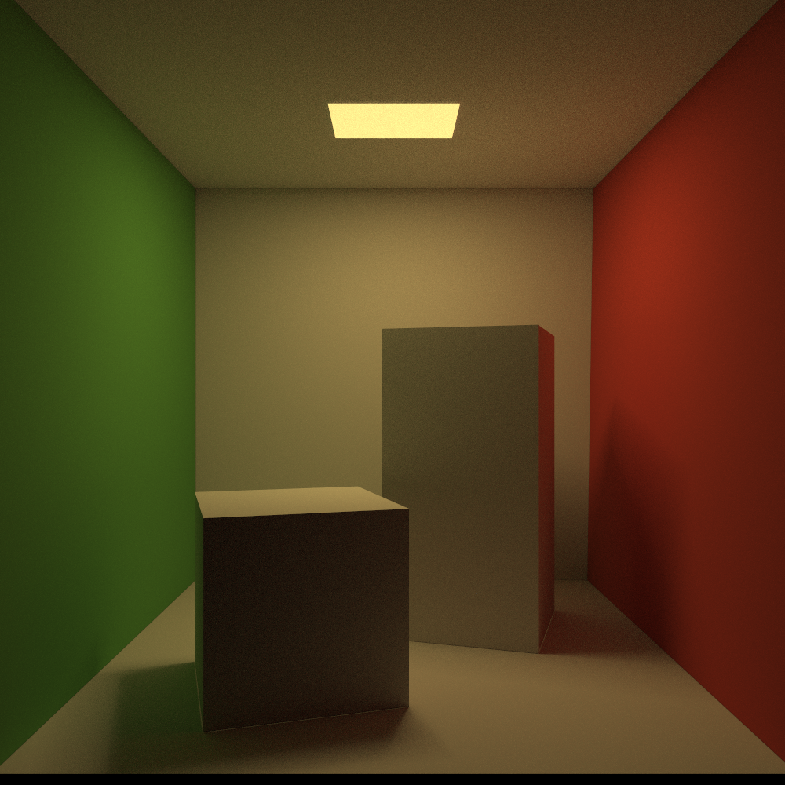

# Miyuki Renderer

This is a hobby project as I learn pbrt. (see http://pbrt.org)

Inspired by https://github.com/JamesGriffin/Path-Tracer, 	https://github.com/fogleman/pt

##  Features:

It is currently using path tracing, bidirectional path tracing, photon mapping (https://graphics.stanford.edu/courses/cs348b-00/course8.pdf)., and sppm. I chose BVH as acceleration structure, with naive split strategy.

It loads .obj files using tiny_obj_loader (the same as my previous projects).

It uses SIMD instructions to intersect multiple triangles at once, resulting in roughly 30%-50% speed boost.

A non-local means filter is used as denoiser (using opencv)

## TODO List:

1. ~~Path tracing with next event estimation~~
2. ~~Photon mapping~~
3. ~~sppm  (Stochastic Progressive Photon Mapping)~~ (see https://www.ci.i.u-tokyo.ac.jp/~hachisuka/ppm.pdf and https://www.ci.i.u-tokyo.ac.jp/~hachisuka/sppm.pdf)
4. ~~Bidirectional path tracing~~
5. Multiple Importance Sampling (MIS)
6. Metropolis Light Transport
7. Rasterizer (for fun)
8. Toon shading
9. Instant radiosity
10. Loading model files using GUI
11. Physically based reflection models
12. Grids
13. Surface heuristic
14. Better sampler
15. Texture
16. Volumetric
17. Participating media
18. Spectrum
19. Depth of field
20. Refactoring (the GUI module is rubbish)
21. Non-local means filter (I wrote one but it doesn't work)
22. Programmable shader (possibly a homemade JIT compiler)

## Gallery

