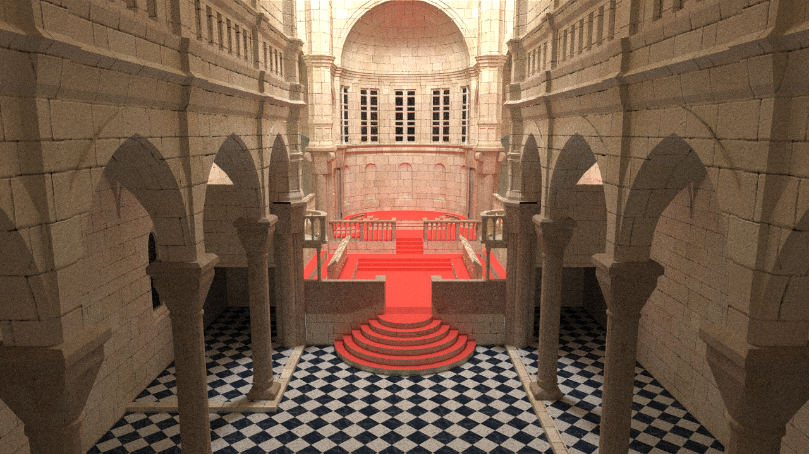
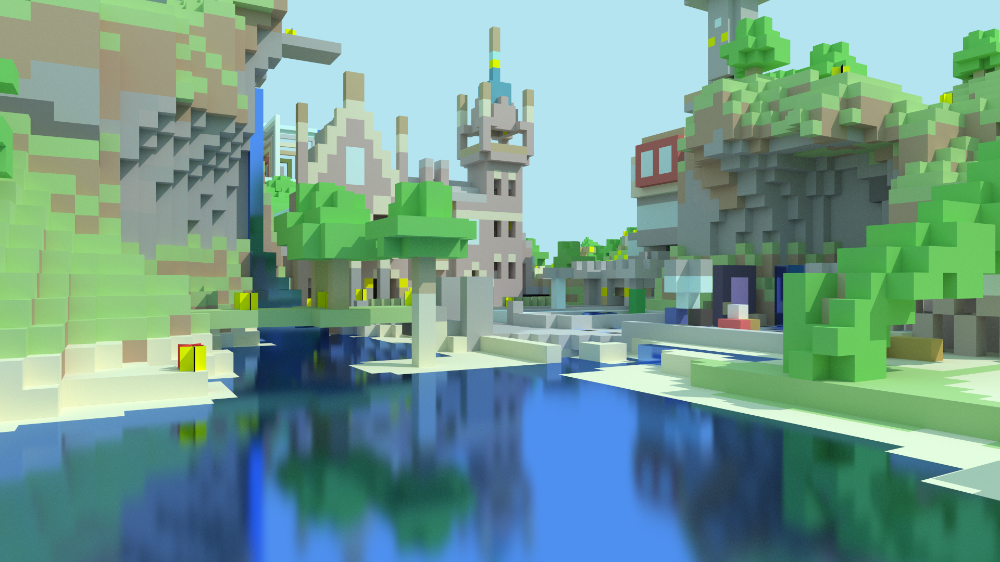
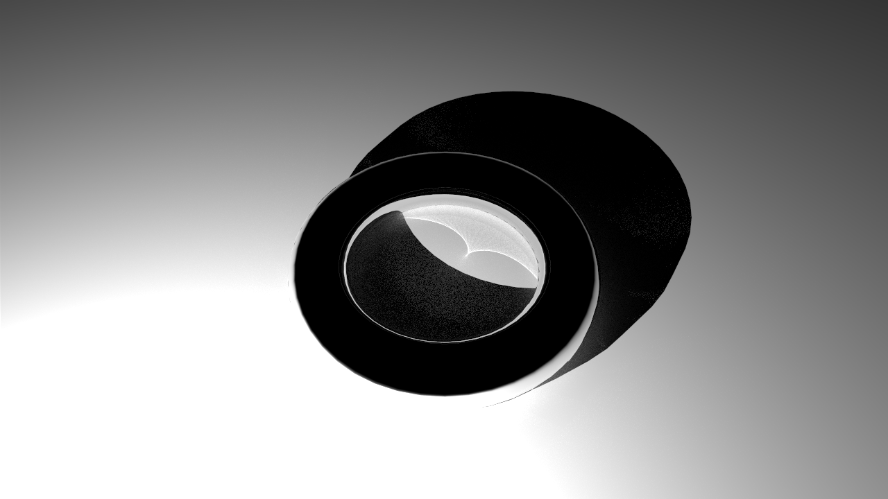
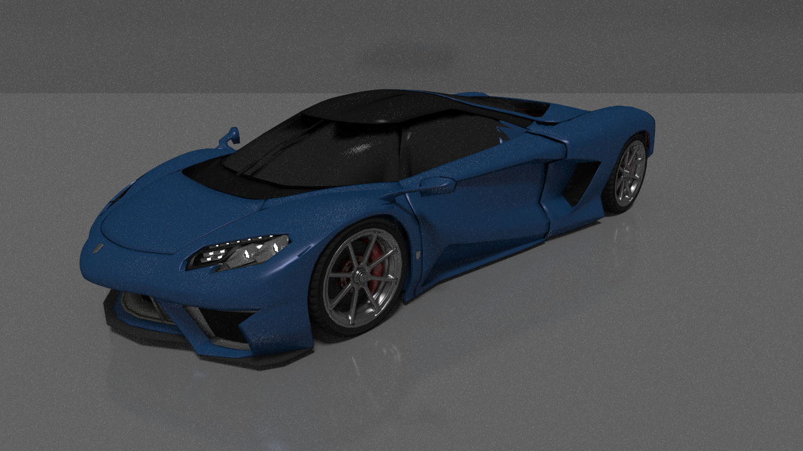
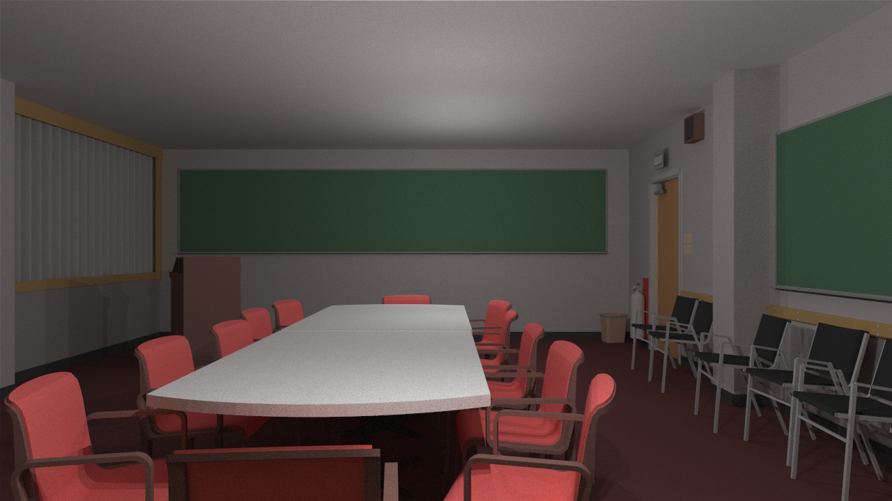
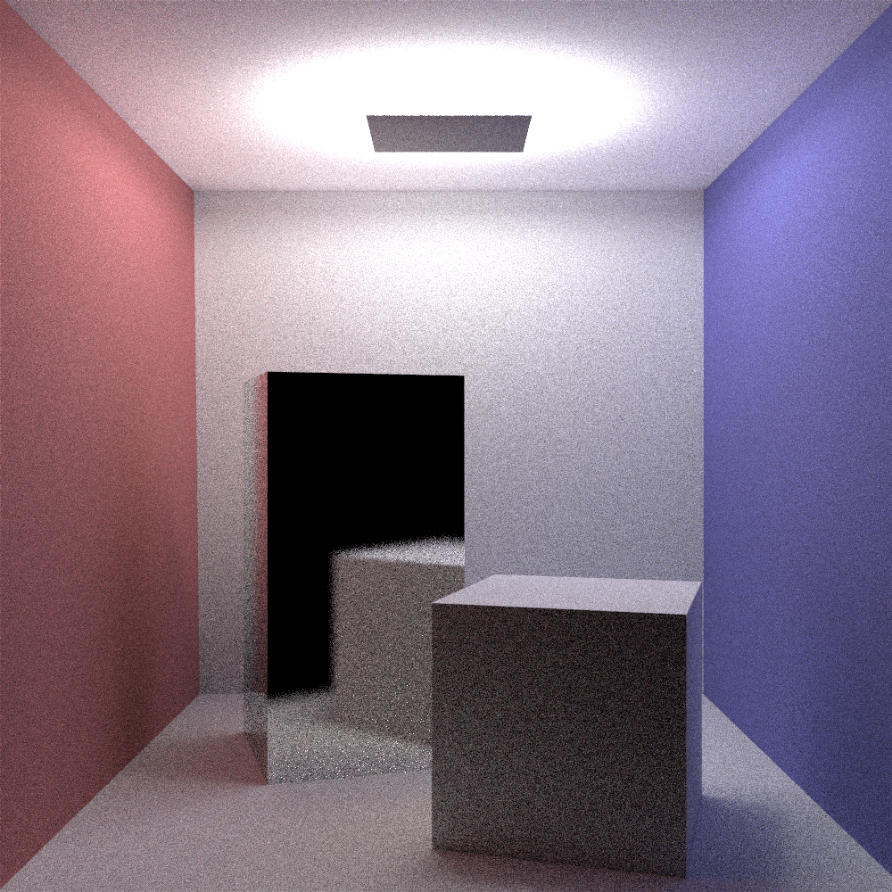

# Miyuki Renderer(WIP)

```
        _             _    _     __                _
  /\/\ (_)_   _ _   _| | _(_)   /__\ ___ _ __   __| | ___ _ __ ___ _ __
 /    \| | | | | | | | |/ / |  / \/// _ \ '_ \ / _` |/ _ \ '__/ _ \ '__|
/ /\/\ \ | |_| | |_| |   <| | / _  \  __/ | | | (_| |  __/ | |  __/ |
\/    \/_|\__, |\__,_|_|\_\_| \/ \_/\___|_| |_|\__,_|\___|_|  \___|_|
          |___/
```

Goal: a high performance pbrt-style renderer. Using Embree for accelerated ray-primitive intersection.

Although this is a CPU-only renderer, utilizing state-of-art rendering methods you can always get a nice image in around 5-10 minutes.

## How to build

Dependencies: Embree 3.0, boost filesystem(not required when on non-Windows).

CMake everything.

## Current Progress 

Available algorithms: path tracing, bidirectional path tracing (default), PSSMLT and multiplexed MLT. BDPT is good at most scenes and converge to a nice results quickly. MLT is also a great solution which, for some scenes, delivers ultra fast convergence.

Available materials: lambertian, oren-nayar, microfacet glossy reflection, mirror

A GUI application is implemented solely for showing progressive rendering results.

##  TODO List

1. Volumetric Path tracing with NEE
2. ~~Ambient Occlusion~~
3. Stochastic Progressive Photon Mapping
4. ~~Primary Sample Space Metropolis Light Transport (Unidirectional)~~
5. Primary Sample Space Metropolis Light Transport (Bidirectional)
6. ~~Multiplexed Metropolis Light Transport~~
7. ~~Bidirectional Path Tracing with MIS~~ 
8. ~~Multiple Importance Sampling~~
9. Vertex Connection and Merging
10. ~~Importance sampling for light source~~
11. Mixed BSDF (partially)
12. Material system
13. Fourier BSDF
14. Environment mapping

# Gallery (Random test images)















