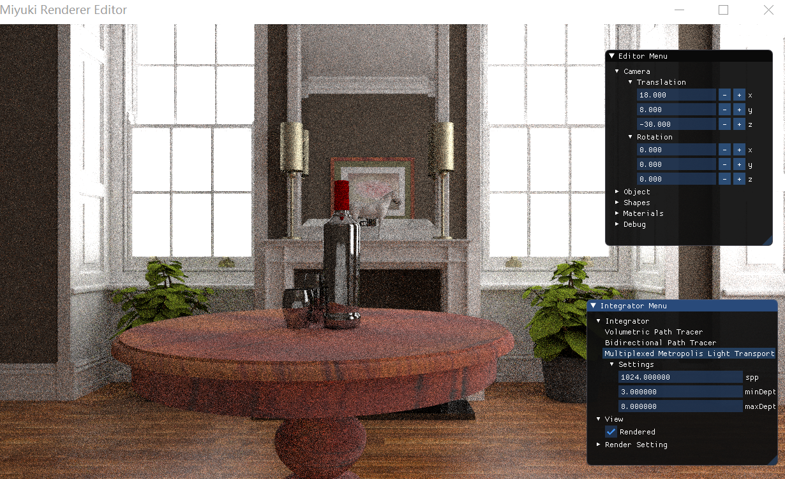
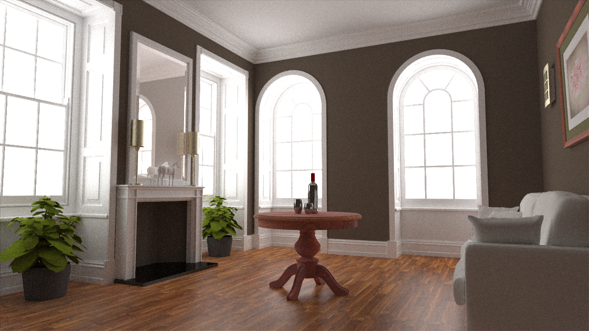

# Miyuki Renderer(WIP)

```
        _             _    _     __                _
  /\/\ (_)_   _ _   _| | _(_)   /__\ ___ _ __   __| | ___ _ __ ___ _ __
 /    \| | | | | | | | |/ / |  / \/// _ \ '_ \ / _` |/ _ \ '__/ _ \ '__|
/ /\/\ \ | |_| | |_| |   <| | / _  \  __/ | | | (_| |  __/ | |  __/ |
\/    \/_|\__, |\__,_|_|\_\_| \/ \_/\___|_| |_|\__,_|\___|_|  \___|_|
          |___/
```

Goal: a high performance pbrt-style renderer. 

## Features (WIP)
### Ray tracing kernels:
 Embree and custom SAH BVH.

### Light transport algorithm:
Volumetric path tracer: Not yet supporting volume though. We also implemented an adaptive integration inspired by Mitsuba.</br>

BDPT: Boring pbrt-style implementation.</br>

Multiplexed MLT: We implemented some of the optimizations suggested by Eric Veach, Hachisuka and other open source MLT implementations like LuxCoreRender. More optimizations needed.

Path Space MLT: Working on it.
All of these algorithms share the same code base, makes it easier to maintain the code.

### Miscellaneous 
We'll have possibly a denoiser and unlikely a blender plugin.

## How to build

Dependencies: Embree 3.0, boost filesystem(not required when on non-Windows).

CMake everything.

## Gallery 
### Editor



### Random test images
Rendered with MMLT.




### From previous version


