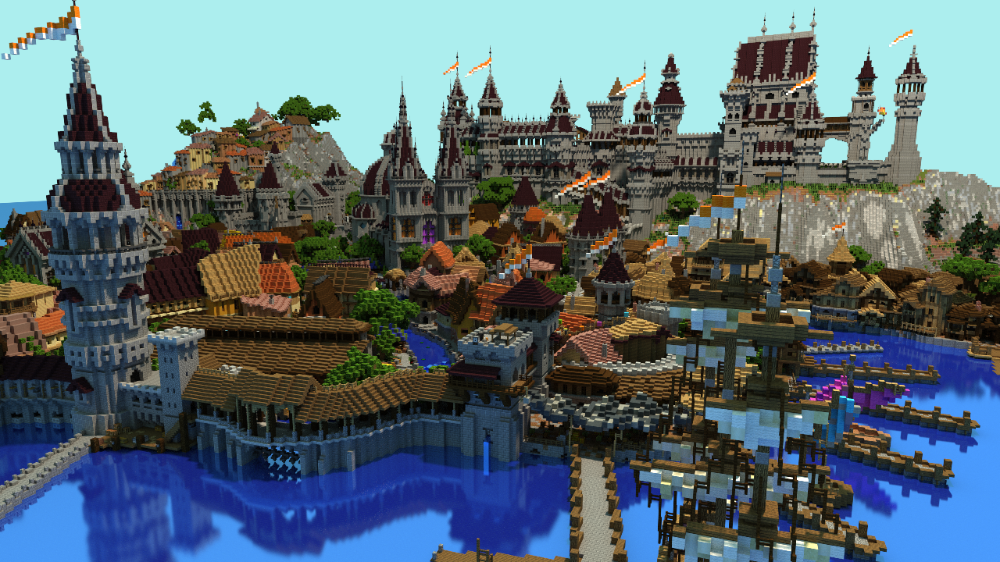
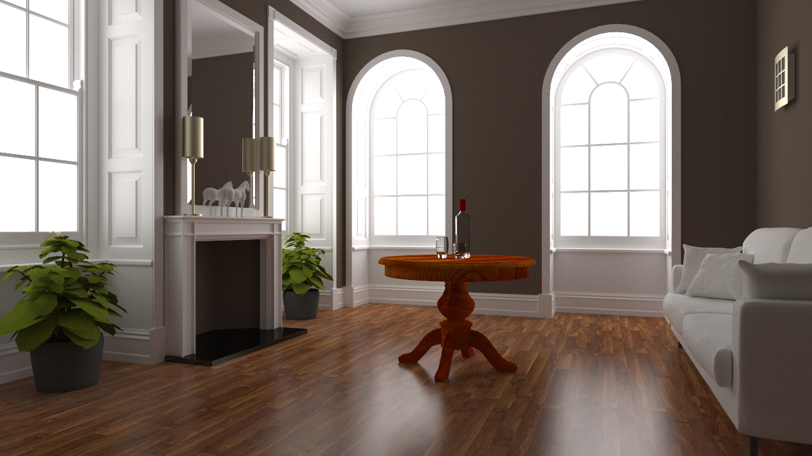
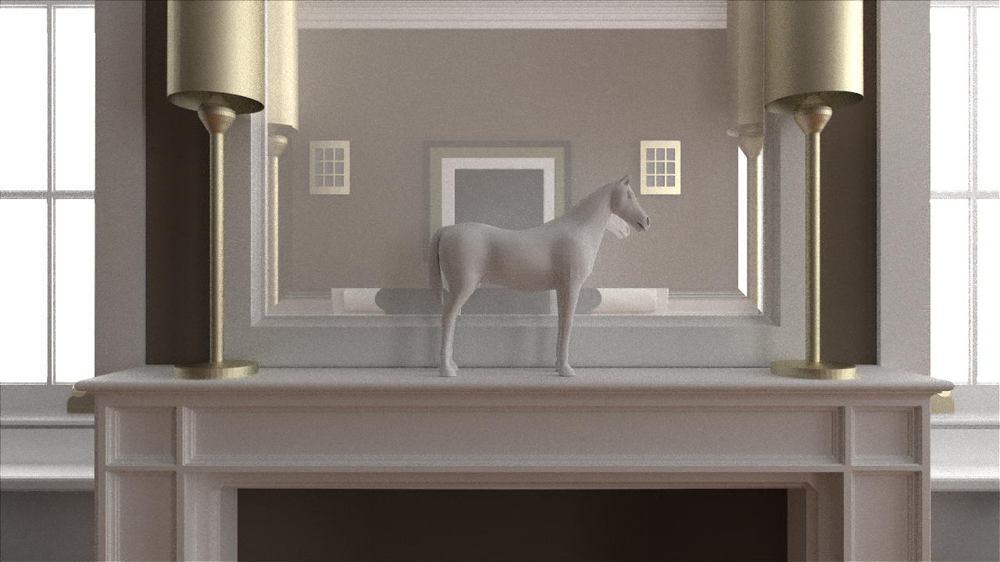
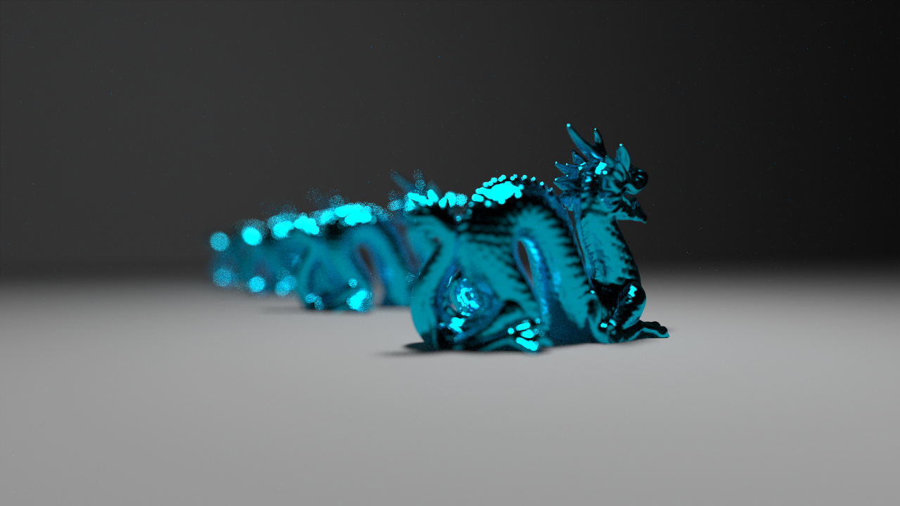
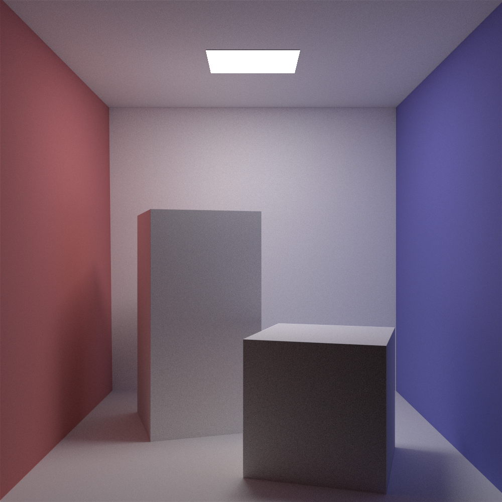
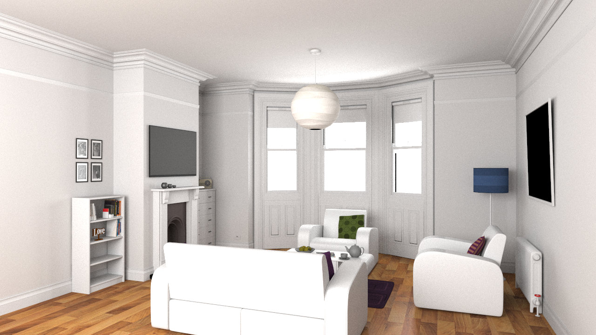
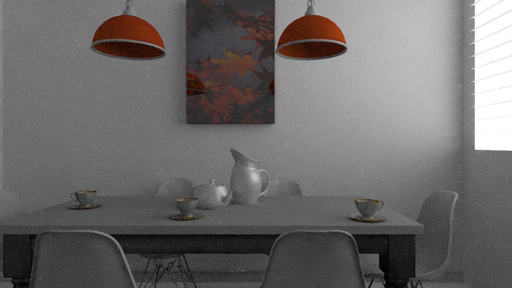
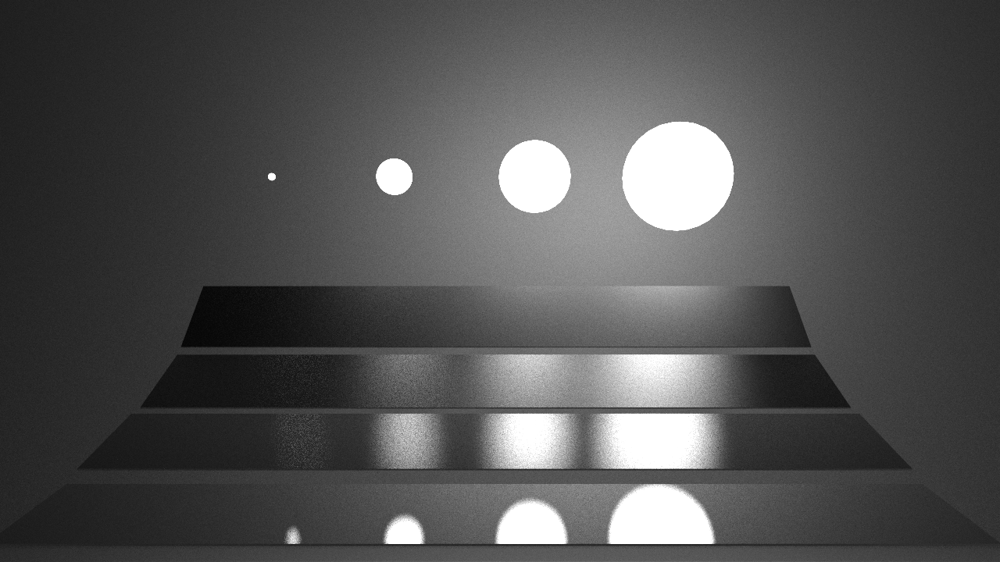

# Miyuki Renderer (Refactoring)

```
        _             _    _     __                _
  /\/\ (_)_   _ _   _| | _(_)   /__\ ___ _ __   __| | ___ _ __ ___ _ __
 /    \| | | | | | | | |/ / |  / \/// _ \ '_ \ / _` |/ _ \ '__/ _ \ '__|
/ /\/\ \ | |_| | |_| |   <| | / _  \  __/ | | | (_| |  __/ | |  __/ |
\/    \/_|\__, |\__,_|_|\_\_| \/ \_/\___|_| |_|\__,_|\___|_|  \___|_|
          |___/
```

Goal: a high performance pbrt-style renderer with low hardware requirements but renders great images quickly (sounds like the ultimate goal for computer graphics though :D)


## File Structure:

`miyuki/reflection`: A custom RTTI/Reflection/GC/Serialization library. 

`miyuki/graph`: Scene graph. All classes in this folder relies on reflection to provide information to the editor. Upon rendering, the graph is compiled to build the data structure used for rendering.

`miyuki/core`: Core renderer code.

`miyuki/core/accelerators`: Acceleration structure interface. 

`miyuki/core/materials`: All materials.

`miyuki/core/intergrators`: All integrators.

`miyuki/hw`: Hardware acceleration. OpenGL for now.

`miyuki/utils`,`miyuki/math`, `miyuki/io`: Utility libraries.

`miyuki/ui`: GUI support.

## Features :
- [x] Custom RTTI/Reflection/Serialization library
  - [x] Non-intrusive reflection
  - [x] RTTI
  - [x] Automatic serialization
- [ ] Editor Support
  - [x] Loading scene files.
  - [x] Importing Wavefront OBJ
  - [ ] Placing mesh files/textures in /mesh, /texture respectively when importing OBJ
  - [ ] Cross platform support. Some GUI code calls native Windows API for now.
- [ ] Custom BVH RT kernel
- [ ] Basic Reflection Model
  - [ ] Diffuse (lambertian/Oren-Nayar)
  - [ ] Beckmann Microfacet Model
  - [ ] GGX Microfacet Model
  - [ ] Specular Transmission/Refelection 
- [ ] Disney BSDF
- [ ] Volume rendering 
- [ ] Path tracing & denoiser
  - [ ] Generic Path Tracer
  - [ ] Denoiser (Using BCD)
- [ ] Path guiding
- [ ] Hybrid rendering
- [ ] Network rendering 

## How to build

Dependencies: Embree 3.0, boost, OpenEXR.

CMake everything. 

## Gallery 
### Random test images










### From previous version








